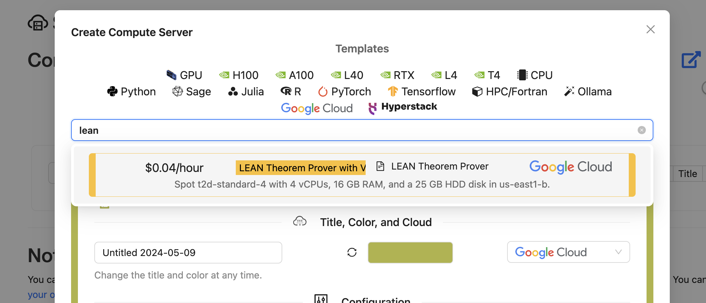
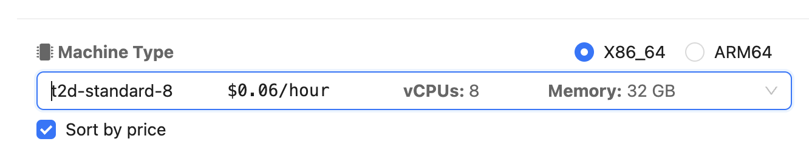
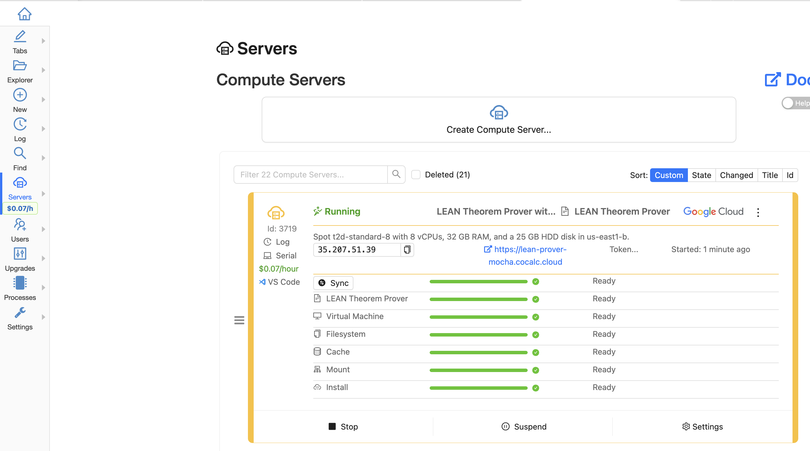
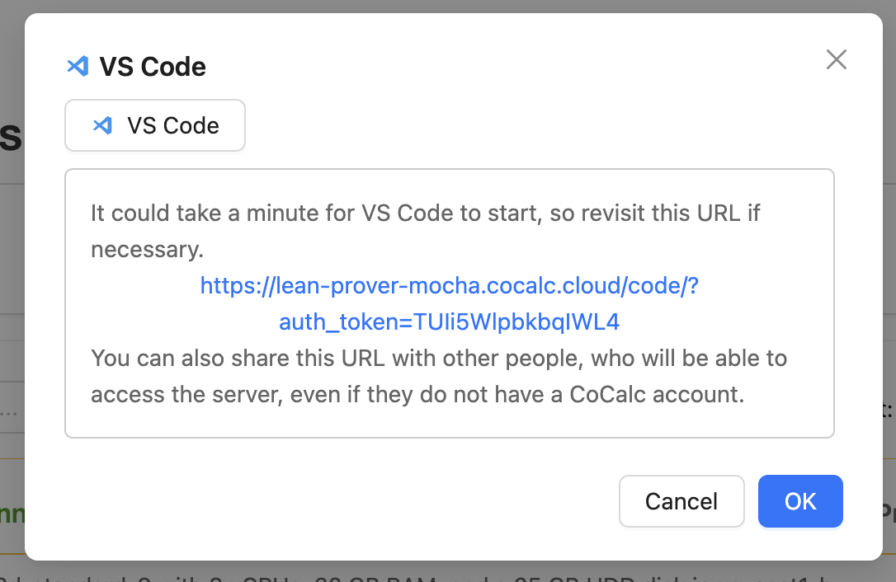
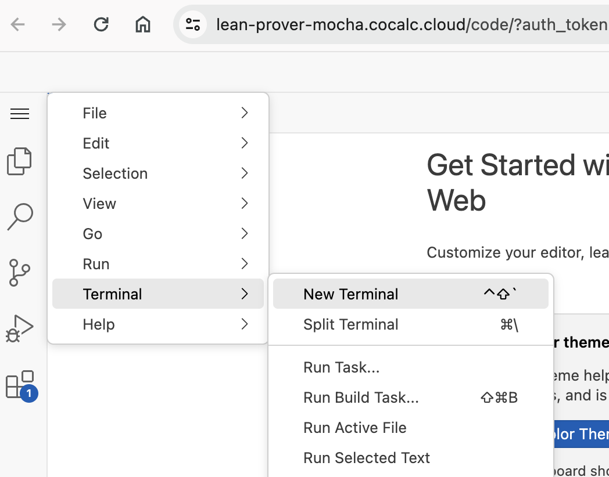
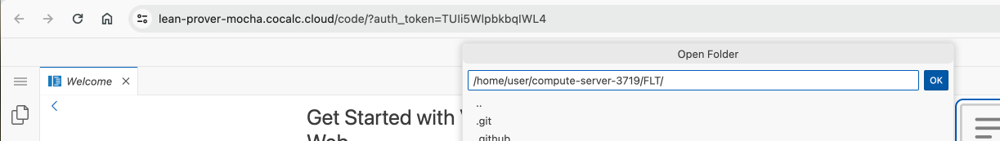
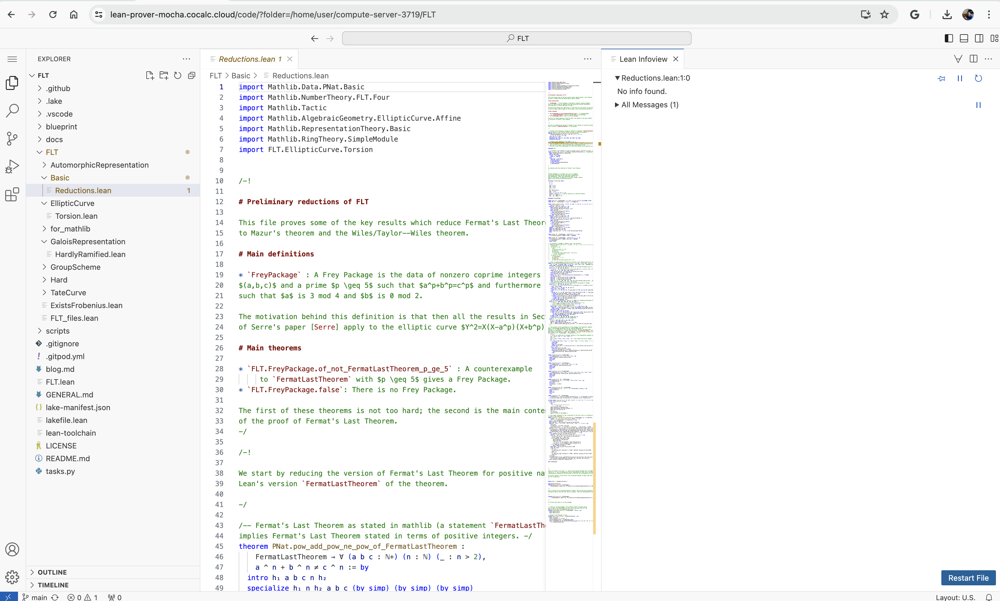

# Using the Lean Theorem Prover on CoCalc with VS Code and a Compute Server

VIDEO: https://youtu.be/H1KzvpgUyMU


<br/>

[Lean](https://lean-lang.org/) is an open source theorem prover that aims to bridge the gap between interactive and automated theorem proving. The CoCalc Lean compute server image comes with Lean 4.x, VS Code, and the Lean VS Code plugin preinstalled. Start it up, and click the 'VS Code' button, then start fully using Lean! 

In this short tutorial, we will install and poke around at [Kevin Buzzard's new FLT LEAN project](https://github.com/ImperialCollegeLondon/FLT) using CoCalc.

Key points:

- It's very fast.
- It's about 10x cheaper than GitHub Codespaces.
- You can easily use any version of Lean, MathLib, lots of disk space, and very powerful servers.

Lean has excellent support for parallel computing, so it is worth it to select a server with a **large number of CPUs**. Since you are likely working interactively, spot instances are often a very good choice, and are priced _**an order of magnitude better**_ than GitHub Codespaces!  For example, [GitHub Codespaces charges \$0.36/hour to use 4 cores and 16 GB of RAM](https://github.com/pricing/calculator#codespaces), whereas on CoCalc a t2d\-standard\-4 spot instance with 4 cores and 16 GB of RAM is about \$0.04/hour.  \(Note that t2d vCPU's are genuine cores, not just hyperthreads.\)    In any case, click on Servers on the left action bar, then "Create Compute Server" and select the LEAN image.  Also, make sure you have at least 25GB of disk on the compute server and set a DNS subdomain name and check the box next to "Automatically Restart".  You can also type "lean" into the template search to find a template with this already configured:



Customize the size of your VM, in case you need more power. For this session, I'm going to use 8 cores instead of 4:



It should take about 2 minutes for your server to build and fully boot up \-\- when it's done all progress bars will be at 100%:



Next click the VS Code button on the left, or the launcher in the "..." menu in the upper right to launch VS Code on your compute server.  You'll see this dialog for a few seconds, then VS Code should appear in a new tab:



Note the auth token in the URL.  If you want to temporarily give somebody else access to your compute server, you can share this URL with them.  They do not have to have a cocalc account.

Switch to the VS Code tab, then create a new terminal:



Type `ls` in the terminal and you'll notice a directory with a name like `compute-sever-3719`. This is a directory that exists only on the compute server itself and is NOT sync'd back to your main cocalc project.  It's fast, and there should be plenty fo disk space free on it., which we'll need when installing Mathlib, etc.  This is a "fast local directory" where the files only exist on the compute server.   If you ever need more space, click on "Settings" in the compute server panel in cocalc, then type in a larger number for the disk space, and within one minute the disk will be larger \(no reboot required!\).

In the terminal, clone [Buzzard's FLT Git Repo](https://github.com/ImperialCollegeLondon/FLT):

```sh
~/compute-server-3719$ git clone https://github.com/ImperialCollegeLondon/FLT
Cloning into 'FLT'...
remote: Enumerating objects: 3163, done.
remote: Counting objects: 100% (423/423), done.
remote: Compressing objects: 100% (158/158), done.
remote: Total 3163 (delta 307), reused 314 (delta 250), pack-reused 2740
Receiving objects: 100% (3163/3163), 30.65 MiB | 72.48 MiB/s, done.
Resolving deltas: 100% (1951/1951), done.
~/compute-server-3719$ cd FLT
~/compute-server-3719/FLT$ ls
FLT  FLT.lean  GENERAL.md  LICENSE  README.md  blog.md  blueprint  docs  lake-manifest.json  lakefile.lean  lean-toolchain  scripts  tasks.py
~/compute-server-3719/FLT$ 
```

Next, [as explained here \(and this is crucial!\)](https://github.com/leanprover-community/mathlib4/wiki/Using-mathlib4-as-a-dependency#getting-started), get the lean cache, so you don't have to wait forever for all of Mathlib4 to compile!

```sh
~/compute-server-3719/FLT$ lake exe cache get
info: downloading component 'lean'
info: installing component 'lean'
info: mathlib: cloning https://github.com/leanprover-community/mathlib4.git to '././.lake/packages/mathlib'
info: checkdecls: cloning https://github.com/PatrickMassot/checkdecls.git to '././.lake/packages/checkdecls'
info: std: cloning https://github.com/leanprover/std4 to '././.lake/packages/std'
info: Qq: cloning https://github.com/leanprover-community/quote4 to '././.lake/packages/Qq'
info: aesop: cloning https://github.com/leanprover-community/aesop to '././.lake/packages/aesop'
info: proofwidgets: cloning https://github.com/leanprover-community/ProofWidgets4 to '././.lake/packages/proofwidgets'
info: Cli: cloning https://github.com/leanprover/lean4-cli to '././.lake/packages/Cli'
info: importGraph: cloning https://github.com/leanprover-community/import-graph.git to '././.lake/packages/importGraph'
installing leantar 0.1.11
  % Total    % Received % Xferd  Average Speed   Time    Time     Time  Current
                                 Dload  Upload   Total   Spent    Left  Speed
  0     0    0     0    0     0      0      0 --:--:-- --:--:-- --:--:--     0
100 1906k  100 1906k    0     0  6351k      0 --:--:-- --:--:-- --:--:-- 6351k

Attempting to download 4454 file(s)
Downloaded: 4454 file(s) [attempted 4454/4454 = 100%] (100% success)
Decompressing 4454 file(s)
unpacked in 9080 ms
~/compute-server-3719/FLT$ 
```

Now it is time to use LEAN.  Open the FLT Folder in VS Code's graphical UI:



The page will refresh and you should grant trust.

You can now start browsing around, and find that you are in the familiar Lean environment, and everything should just work as you expect:



If things aren't fast enough, you have two options:

- stop your compute server and change the machine type to a faster one
- create a new compute server that is geographically closer to you

If you have more questions or requests, email us at [help@cocalc.com](mailto:help@cocalc.com).

Thanks!

William

